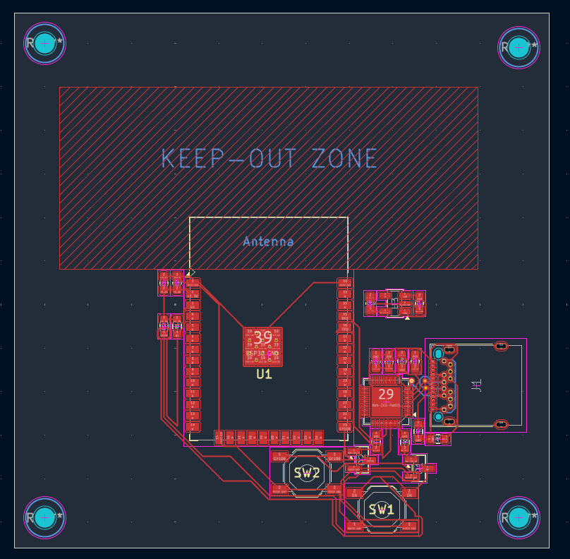
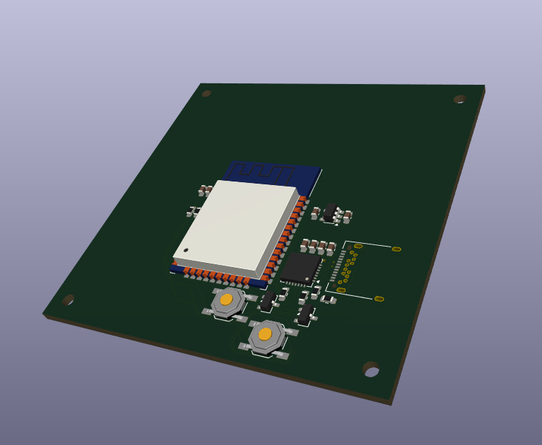

# Kibo
Say hi to Kibo! Kibo is a desktop companion robot that recognizes human emotions and responds through movement, sounds and visual feedback! 

This project was created for [Horizons | Hack Club](https://horizons.hackclub.com)!

---

  

---

## What is Kibo?

So the primary idea behind Kibo is for it to be a desktop companion that emotionally connects to people (especially teenagers) and keeps a track of their moods and emotions and to sort of create a register of behavioral patterns. It is designed to understand human emotions and respond through sound and visual feedback.

It has a lot of sensors and a custom designed PCB that pieces together Kibo!

## Schematic and PCB Images

  

 Image of the PCB used in Kibo!

  

 3D view of the PCB used in Kibo!

