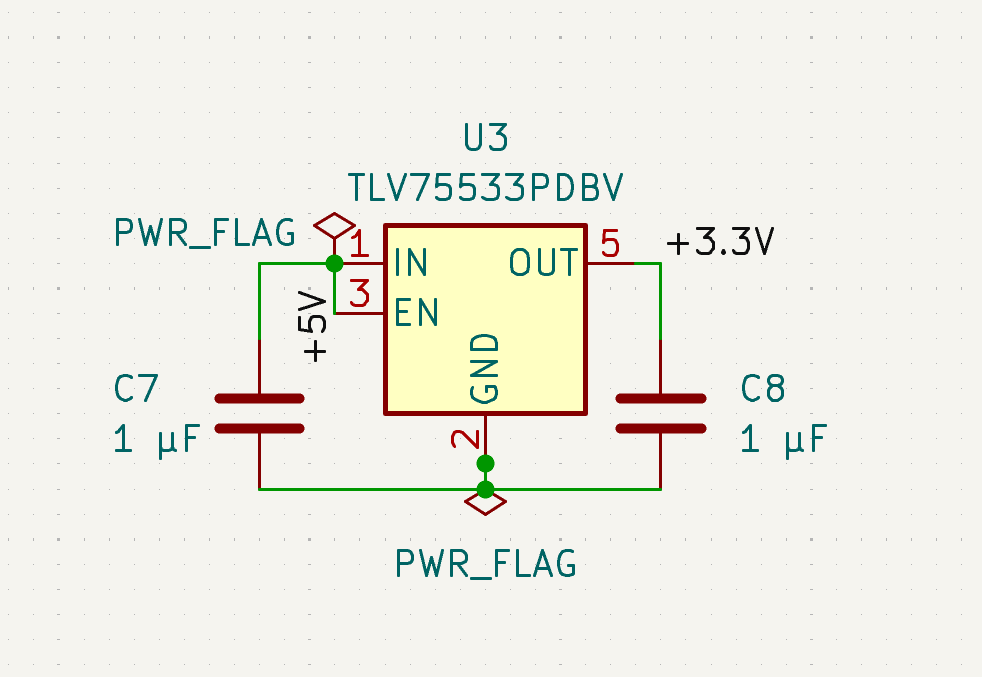
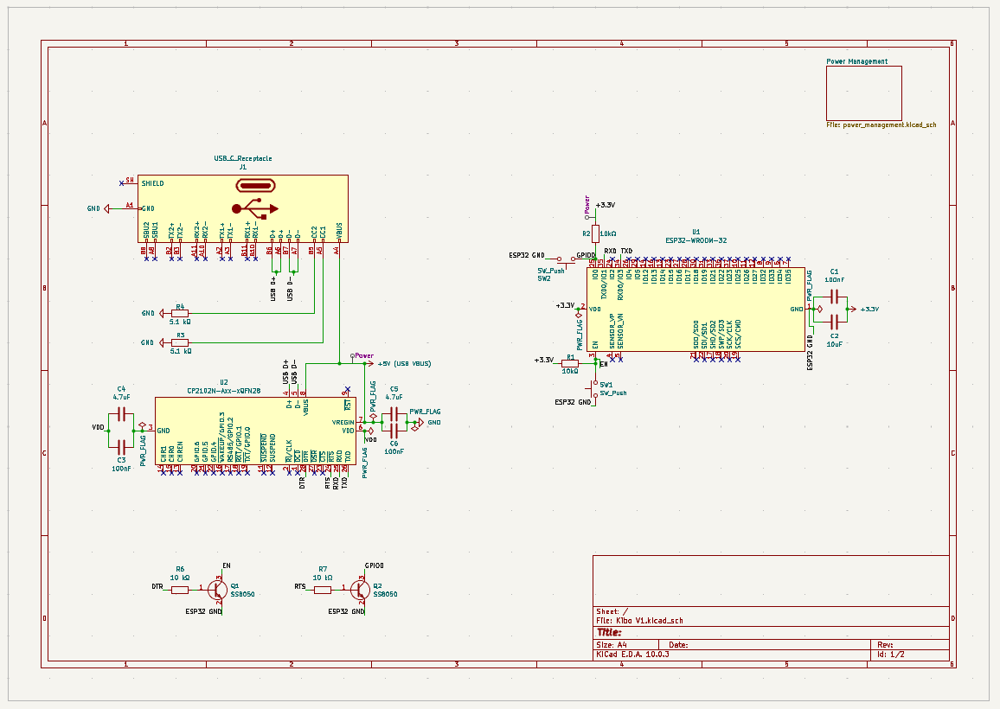

# Journal Entry 1

I spent today mostly focusing on and enhancing the current frontend of Kibo! Added a few effects and changed around the layout. This frontend can primarily serve Kibo for now and I can head on to the logo making and later to the PCB and schematic production! Only spent like an hour on Kibo today, but it was heavily crucial! Looking forward to the next session.

  

  

# Journal 2 Entry

So, spent most of my time today in enhancing and making the current website better. I also created like a small logo for Kibo on the best editing software on earth (yep Figma)! Going to start off with the hardware design soon!

  

## Lapse link: https://lapse.hackclub.com/timelapse/S7I8zirjqjAx

---

# Journal Entry 3

I am logging this journal after a very long while! I was busy completing other projects for Fallout and Beest so couldnt take out time. Anyways, I started my work on the schematic of Kibo and started laying out the basic essential components like the microprocessor, resistors, capacitors etc. Also began basic connections across the electronic components today!

  

## Lapse link: https://lapse.hackclub.com/timelapse/hq-d3p9BIPCX

---

# Journal Entry 4

So went halfway through the schematic but realized that the power management seemed to not plan out as it was supposed to. So got rid of some components and replaced some items. This one took a while. Hopefully aim to finish the rest hassle free!

  

## Lapse link: https://lapse.hackclub.com/timelapse/KcQHf7XceceQ

---

# Journal Entry 5

Most of todays time went in fixing the miscellaneous errors that I did in the previous session. But still I managed to show some progress in the schematic as I made it much more tidier and also easy to understand which will later help me while routing the PCB. 

  

## Lapse link: https://lapse.hackclub.com/timelapse/TlNTNZHFK43F

---

# Journal Entry 6

This session was actually an unproductive one. Just spent another hour continuing my schematic work and nothing much occurred. Hope to have a more productive next session.

  

## Lapse link: https://lapse.hackclub.com/timelapse/_9OL0leXBFjI

---

# Journal Entry 7

Alright! I am like done with the major chunk of the schematic and in this session also added an external power management source to Kibo! I am very excited to finally start with routing my PCB!!!

  

## Lapse link: https://lapse.hackclub.com/timelapse/U1hjjuSv5-ld

---

# Journal Entry 8

FINALLY DONE WITH MY SCHEMATIC YAYAYAYAYAYA. Whew gotta say that this took a LOT longer than I expected it to take. But now I finally have a complete schematic with the power sorted out and all the components ready to be routed!!! I am now moving on to routing the actual PCB (god its gonna take a whole long time)!

  

  

## Lapse link: https://lapse.hackclub.com/timelapse/rOlEhreOZ3rq

---

# Journal Entry 9

Started off fresh into KiCad with planning and mapping out the placement of where each electronic component would go! Once this gets sorted, (which i believe will take a long, long time) I will move on to actually figuring out how I am going to route this one mess of a PCB. Well lets see about that later!

  

## Lapse link: https://lapse.hackclub.com/timelapse/IF5BVcbRP5JO

---

# Journal Entry 10
I am still fairly confused on how I can efficiently place which component where. For example, I obviously plan on keeping the ESP32 at the center and towards its upper left (where in the CAD, only the wall will be there) i plan on keeping the non-involved components such as all the resistors, capacitors etc. Now, this arrangement is having its issues with he ground fill currently. Well I hope in the upcoming session I eventually manage to think of something!

  

## Lapse link: https://lapse.hackclub.com/timelapse/qdKALKwEf3x7

---

# Journal Entry 11

So finally managed to come up with a solution to the placement of my components. Now the plan is that my USB receptor will sit on the bottom right of the PCB so that it will be easy to later cut out a hole of the USB-Type A pin to the CAD. And for the power management section, I have placed it RIGHT above the usb receptor as it is completely independent and obviously it was the best spot to place it. Remaining resistors, capacitors and all the extras as discussed earlier I have decided to keep on the left side of the PCB so that it would be easy to solder and obviously it wont obstruct any other component.

  

## Lapse link: https://lapse.hackclub.com/timelapse/Nwm_jdcFJgBA

---

# Journal Entry 12

Okay so the placement design that I had planned had only SOME minor flaws which i fixed! Right now i believe that placement of all the components is done and its FINALLY time to do routing!!! Routing will definitely take a lot of time so I am VERY curious how long it would take. 

  

## Lapse link: https://lapse.hackclub.com/timelapse/Nwm_jdcFJgBA

---

# Journal Entry 13

Routed some final traces and had to manually route all the GND traces cause I had a little issue in the clearance of my traces. Well it seems like my PCB is now OFFICIALY complete! YAYAYAYAYAYAYAYA!!! Now  next I am going to start on the CAD assembly for Kibo on Fusion!

  

## Lapse link: https://lapse.hackclub.com/timelapse/10Ho6kmtho1i and https://lapse.hackclub.com/timelapse/TDIHzewKLg1E

---

# Journal Entry 14

After completing my PCB I started doing some basic research on Automatic Speech Recognizing (ASR) systems and how they fundamentally work. Came across a pretty dope and cool lecture by an accomplished professor in Engineering and watched that lecture till the end. It was a very useful lecture and I definitely learned a lot of things from it.

  

## Lapse link: https://lapse.hackclub.com/timelapse/D7tLjoJz0OnE

---

# Journal Entry 15

In  this session I also focused primarily on the research end of my project and started researching on how my speaker (4 Ω, 3 W) will adapt and connect with the microprocessor (ESP32) so watched a quick review video on the same! 

  

## Lapse link: https://lapse.hackclub.com/timelapse/McsXMgCqCPQ_

---

# Journal Entry 16

So before moving on to the CAD, I generated the Gerber files of my PCB and then pushed the PCB to this github repo. After doing that I, for the FIRST TIME in my life, opened Fusion. Gotta say that it was VERY complex looking at all of the dashboard at first, but as I started messing around with things it eventually started making sense.

  

## Lapse link: 

